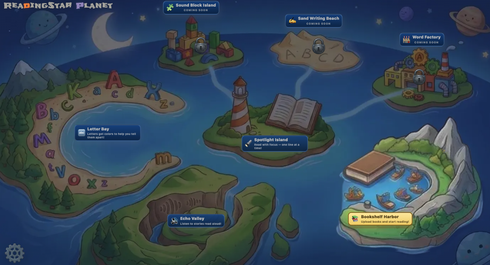
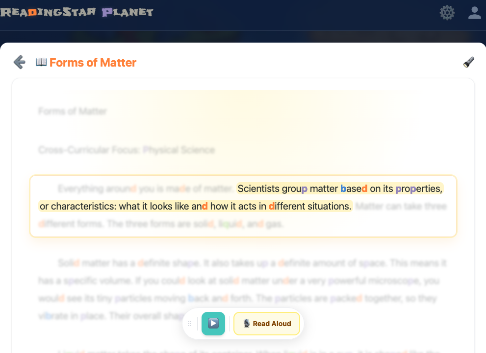
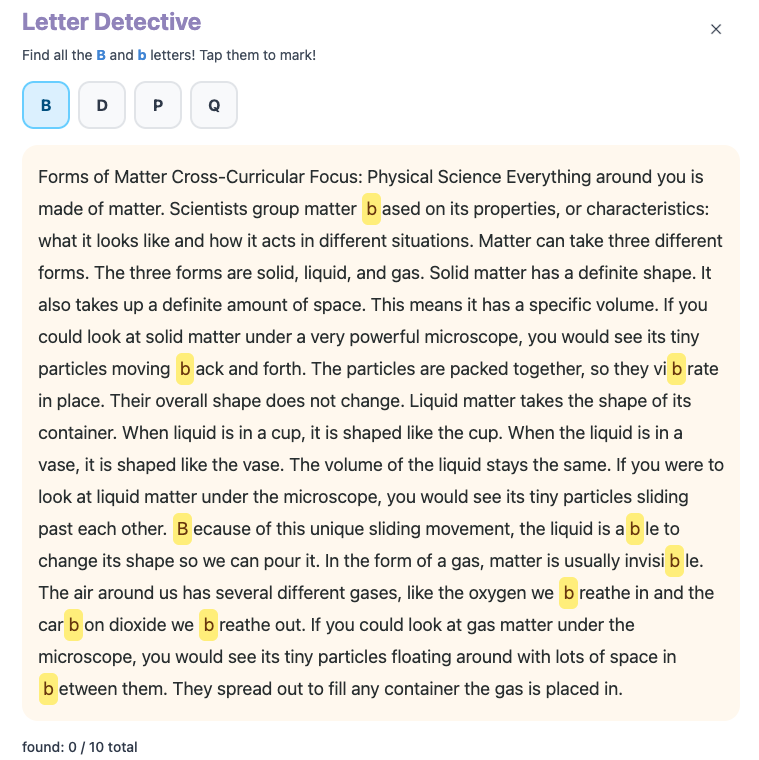

# ReadingStar Planet

ReadingStar Planet is a Next.js reading support app designed for children who benefit from structured, low-friction reading assistance. It combines reading focus tools, text-to-speech support, document management, and role-based administration in a single web app.

## Features

- Guided reading modes with adjustable font size, line spacing, masking, and themed focus views
- Text-to-speech support with voice preview and reading companion controls
- PDF, TXT, and pasted-text import flows with preview and editing before saving
- Library management with document grouping, search, sorting, editing, and reading history
- Role-aware account management, profile editing, and admin-only global defaults
- Document access control — three visibility levels (Public, Admin Only, User Groups) for both bookshelves and individual books, per-book override support
- User group management — admins can create and manage groups, assign users, and grant group-level access to content
- English and Chinese UI support, plus PWA support for an app-like experience

## Screenshots

### Homepage
An inviting entry point into the ReadingStar planet adventure.



### Spotlight Reading
Keep the paragraph focused by highlighting a chosen character.



### Letter Detective
Practice spotting letters that are easy to confuse.



## Tech Stack

- Next.js App Router
- React + TypeScript
- Tailwind CSS
- SQLite via better-sqlite3
- Vitest and Playwright for testing

## How To Run

### Requirements

- Node.js 22+
- npm

### Install

```bash
npm install
```

### Development

```bash
npm run dev
```

Open http://localhost:3000.

### Production Build

```bash
npm run build
npm start
```

### Tests

```bash
npm test
```

For end-to-end coverage:

```bash
npm run test:e2e
```

## Access Control Notes

- Admins can assign visibility at the bookshelf level or override it per book.
- Books moved between bookshelves prompt for confirmation when the effective audience would change.
- Books without a bookshelf stay in an Ungrouped area and default to `Admin Only` visibility until an admin changes them.
- Direct visits to `/read/[id]` are checked on the server and return the standard 404 page when the book is missing or not accessible to the current viewer.

## Environment Notes

- Google sign-in is optional and requires local environment variables such as `GOOGLE_CLIENT_ID`, `GOOGLE_CLIENT_SECRET`, and `GOOGLE_REDIRECT_URI`.
- The SQLite database is created locally under `data/` by default, or you can override the location with `READINGSTAR_DB_PATH`.
- You can seed an initial admin account with `INITIAL_ADMIN_EMAIL`.

## License

This project is licensed under the MIT License. See the LICENSE file for details.